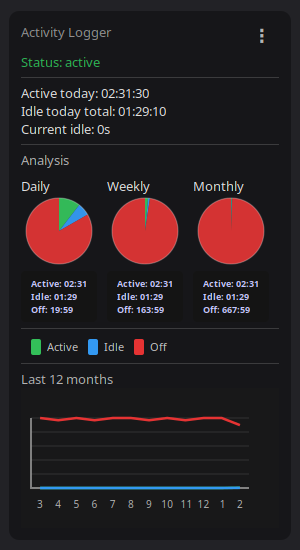

# Activity Logger Desklet

**Track your computer activity with real-time pie and line charts in Cinnamon.**

A lightweight Cinnamon desklet that monitors active, idle, and system-off time. Get instant visual feedback on daily/weekly/monthly usage patterns and track trends over a full year.



## Features

- **Real-time Tracking**: Monitors active (keyboard/mouse input detected) and idle time automatically
- **Three Period Views**: Daily, weekly, and monthly pie charts with color-coded breakdown
- **Yearly Trend Chart**: Line graph showing monthly activity patterns over 12 months
- **Smart Dependency Handling**: Detects missing dependencies and offers one-click install
- **Privacy First**: Records only timing metadata—no keyboard content, mouse tracking, or app snooping
- **Persistent Data**: Activity logs stored locally in JSON format under desklet directory
- **Informative Status**: Current idle time, today's totals, and system state at a glance
- **Tooltip Details**: Charts display exact Active/Idle/Off breakdown in hh:mm format
- **Custom Menu**: Built-in report generation and yearly statistics viewer

## Quick Start

### Requirements
- **Cinnamon Desktop** (tested on Linux Mint)
- **xprintidle** (system idle time reader)

### Install Dependencies

**Debian/Ubuntu:**
```bash
sudo apt update
sudo apt install xprintidle
```

**Fedora/RHEL:**
```bash
sudo dnf install xprintidle
```

### Add the Desklet
1. Move the folder to `~/.local/share/cinnamon/desklets/activity-logger@cinnamon/`
2. Open Cinnamon Settings → Desklets
3. Find "Activity Logger" and click the `+` to add it
4. If xprintidle is missing, the desklet shows instructions to install it

## Project Structure

```
activity-logger@cinnamon/
 desklet.js # Main entry point & UI orchestration
 metadata.json # Cinnamon desklet manifest
 stylesheet.css # UI styling
 README.md # This file
 LICENSE # MIT license
 CONTRIBUTING.md # Contributor guidelines

 src/ # Modular source code
  constants.js # Colors & timing config
  utils.js # Helpers (time, date, idle detection)
  dataLogger.js # JSON persistence layer
  statsCalculator.js # Metric aggregation (daily/weekly/monthly/yearly)
  customMenuManager.js # Menu UI & handlers
  chartManager.js # Cairo-based chart rendering

 data/ # Runtime data (git-ignored)
  .gitkeep # Keeps directory in repo
  activity-log.json #  Not committed (local only)

 docs/ # Documentation
 DOCUMENTATION.md # Technical deep-dive
 PUBLISHING.md # Release checklist
 screenshot.png # UI preview
```

## Privacy & Security

 **No content logging**: Keyboard input, clicked links, or app names are never recorded
 **Only timing data**: Records active duration, idle duration, and system-off gaps
 **Local storage only**: Data stays in `data/activity-log.json` on your machine
 **Open source**: Audit the code yourself (licensed under MIT)

## How It Works

1. **Polling Loop**: Every second, queries system idle time via `xprintidle`
2. **State Detection**: Compares idle time to detect active (typing/moving), idle (no input), or off (no change)
3. **Daily Aggregation**: Totals cumulative seconds per state each day
4. **JSON Storage**: Persists logs with date keys; calculates rolling statistics on-demand
5. **Chart Rendering**: Cairo canvas renders pie segments (green=active, blue=idle, red=off) and yearly line trends

## Data Format

The activity log (`data/activity-log.json`) stores daily totals:
```json
{
"2026-02-23": { "active": 7200, "idle": 28800, "off": 0, "lastUpdate": 1708695600 },
"2026-02-24": { "active": 10800, "idle": 25200, "off": 0, "lastUpdate": 1708782000 }
}
```

- **active**: Seconds with keyboard/mouse input detected
- **idle**: Seconds with no input (screen may be on or off)
- **off**: Seconds system was likely off (calculated as gap in data stream)
- **lastUpdate**: Unix timestamp of last update for that day

## Usage

### Once Installed
- **Status Panel** shows current state (active/idle)
- **Daily/Weekly/Monthly Charts** update every second
- **Yearly Chart** displays monthly totals as connected line
- **Right-Click Menu** offers "Report Issue" and "Yearly Statistics"
- **Charts Display** exact Active/Idle/Off times in hh:mm format

### Generate Report
From the menu (⋮ button), choose "Report Issue" to:
1. Describe the problem
2. Optionally attach last 24 months of activity logs
3. Submit feedback

## Troubleshooting

**Charts not updating?**
- Check if xprintidle is installed: `which xprintidle`
- Verify Cinnamon sees the desklet (may need restart)

**Missing dependency warning?**
- Click "Install" button in the warning panel, then "Retry"
- Or manually: `sudo apt install xprintidle`

**Reset data?**
- Remove `~/.local/share/cinnamon/desklets/activity-logger@cinnamon/data/activity-log.json`
- Desklet will create fresh log on next run

##  License

MIT License — see [LICENSE](LICENSE) for details.

##  Credits

- Built for Cinnamon Desktop (Linux Mint)
- Uses Cairo for chart rendering
- Inspired by system activity monitoring tools

---

**Questions or ideas?** Open an issue or PR on GitHub!
